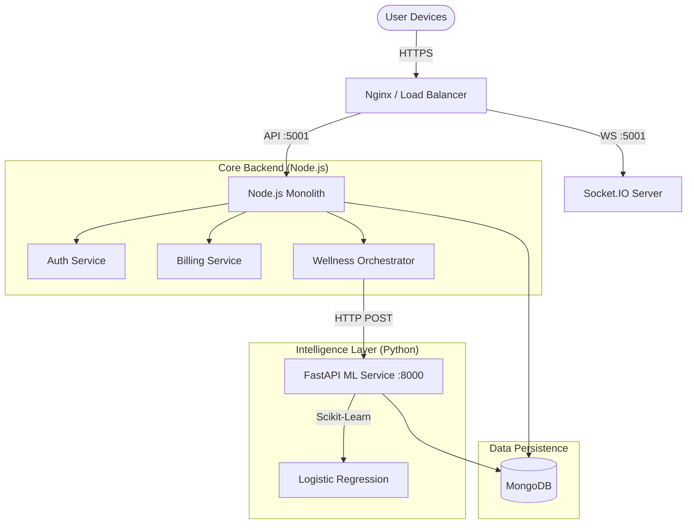

# LifelineX Hospital Information System (HIS) - Backend Architecture

## 1. System Overview

The backend follows a **Hybrid Microservice Architecture**, leveraging Node.js for high-throughput I/O operations and Python for specialized computational ML tasks.

### High-Level Topology

---

## 2. Core Backend Structure (Node.js)

The application follows the **Model-View-Controller (MVC)** pattern (Service-Controller variant).

### 2.1 Request Life Cycle
1.  **Entry Point (`server.js`)**:
    *   Initializes Express App, DB Connection, and Socket.io.
    *   Applies Global Middleware: `helmet` (Security), `cors`, `morgan` (Logging), `rateLimit`.
2.  **Routing (`routes/`)**:
    *   Maps URI paths to controllers.
    *   Example: `/api/v1/patient/auth/login` maps to `routes/patient/patientAuth.routes.js`.
3.  **Middleware (`middleware/`)**:
    *   **Interceptor Layer**: Logic that runs *before* the controller.
    *   `auth.middleware.js`: Verifies JWT tokens, attaches `req.user`.
    *   `role.middleware.js`: RBAC (e.g., Doctors can't delete Billing logic).
4.  **Controller (`controllers/`)**:
    *   **Interface Layer**: Handles HTTP Request/Response objects.
    *   Validates input, calls Services, sends JSON response.
5.  **Service (`services/`)**:
    *   **Business Logic Layer**: Reusable logic independent of HTTP (e.g., `WellnessAgentOrchestrator`).
6.  **Model (`models/`)**:
    *   **Data Layer**: Mongoose schemas defining MongoDB document structure.

### 2.2 Directory Map
| Directory | Purpose |
| "models" | Mongoose Schemas (Database definition) |
| "controllers" | HTTP Request Handlers (Req/Res logic) |
| "services" | Complex Business Logic (Agent orchestration, heavy calc) |
| "routes" | API Endpoint definitions |
| "middleware" | Security & validation interceptors |
| "scripts" | Independent Python scripts & Migration tools |
| "config" | Environment constants (DB URI, API Keys) |
| "socket" | Real-time event handlers |
| "utils" | Helpers (Logger, Emailer, PDF Generator) |

---

## 3. Real-Time Communication (WebSockets)

We use **Socket.io** attached to the same HTTP server port (5001).

### 3.1 Architecture
The socket instance `io` is attached to the Express `app` object (`app.set('io', io)`). Controllers retrieve this instance via `req.app.get('io')` to emit events asynchronously.

### 3.2 Key Event Flows
*   **Emergency Dashboard**:
    *   **Trigger**: New `Emergency` document created in `emergency.controller.js`.
    *   **Event**: `io.emit('emergency-update', data)`
    *   **Client**: Nurse stations flash red immediately.
*   **OPD Queue**:
    *   **Trigger**: Doctor marks patient as "Checked In".
    *   **Event**: `io.emit('opd-queue-update', departmentId)`
    *   **Client**: Waiting room display updates live.

---

## 4. AI & Machine Learning Integration

The system uses a **Sidecar Pattern** where the Node.js app offloads intelligent decision-making to a local Python service.

### 4.1 The Wellness Agent (Agentic Workflow)
Located in `services/agentic/`, this system acts autonomously.

1.  **ContextTool**: Aggregates distributed data (Patient Logs, Vitals, History).
2.  **Orchestrator**: The "Brain" running the OODA Loop.
3.  **NudgeSelectionTool**: The bridge to ML.
    *   Prepares a feature vector (e.g., `[health_score: 50, trend: -1]`).
    *   Sends HTTP POST to `http://localhost:8000/predict`.

### 4.2 The ML Microservice
Located in `scripts/ml_nudge_service.py`.
*   **Stack**: Python 3.12, FastAPI, Scikit-Learn.
*   **Function**: Stateless inference engine.
*   **Model**: Logistic Regression (for explainability).
*   **Training**: `scripts/train_nudge_model.py` fetches logs from Mongo, trains model, and serializes to `.joblib`.

---

## 5. Database Architecture (MongoDB)

We use **MongoDB** for its flexibility with healthcare data (documents with varying fields).

### 5.1 Key Domains
*   **Identity**: `User`, `Patient`, `Staff`
*   **Clinical**: `EMR`, `Prescription`, `Vitals`, `LabReport`
*   **Operations**: `Billing`, `Inventory`, `Bed`, `Appointment`
*   **Intelligence**: `CareNudge`, `NudgeEvent` (Training Data), `HealthScore`

### 5.2 Agentic Nudge Data Flow
1.  **Frontend**: Patient views dashboard.
2.  **API**: `GET /api/v1/patient/nudge`
3.  **Orchestrator**:
    *   Reads `HealthScore` & `Signal` (Logs).
    *   Calls ML Service.
    *   Creates `CareNudge` document (Status: Active).
    *   Creates `NudgeEvent` document (for future training).
4.  **Frontend**: Displays Nudge Card based on `CareNudge` data.

---

## 6. Future Roadmap (Recommended)

1.  **Redis Caching**:
    *   Cache `ContextTool` results to reduce Mongo load.
    *   Store Socket.io sessions for multi-instance scaling.
2.  **PostgreSQL Migration (Billing)**:
    *   Move `Billing` and `Inventory` to SQL for strict ACID transactions.
    *   Maintain `Patient` data in Mongo (Dual-Database architecture).
